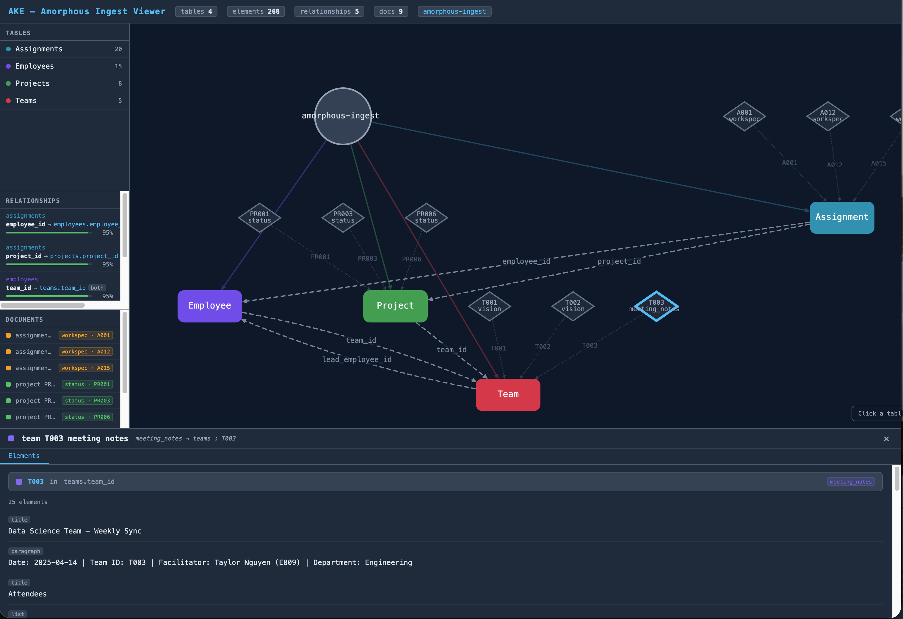

# Amorphous Knowledge Engine (AKE)

A domain-agnostic, pre-compiled artifact retrieval system for agentic workflows. AKE ingests raw knowledge from any source — documents, tables (Upcoming - Knowledge Graphs) — extracts typed, cited facts at ingest time, and serves them to agents through a declarative query interface and an MCP server layer.

---

## Core Idea

Most retrieval systems make agents do expensive work at query time: parse documents, call LLMs to extract facts, resolve entities. AKE inverts this. Extraction is compiled once at ingest. Agents declare *what* they want; AKE returns typed, cited answers from a pre-built artifact store.

```
Source documents / tables / graphs
        │
        ▼ (once, at ingest)
   Ingestion & Parsing  ──►  Element store
        │
        ▼
  Artifact Compilation  ──►  Postgres + pgvector
        │
        ▼
  Declarative Query Layer ◄── Agent / MCP caller
        │
        ▼
  Cited, shape-conformant QueryResult
```




---

## Four Layers

| Layer | What it does |
|---|---|
| **1 — Ingestion & Parsing** | Normalises PDF, DOCX, HTML, Parquet, CSV, RDF, and property graphs into typed `Element` records with stable IDs and section paths |
| **2 — Artifact Compilation** | Runs LLM extraction (or direct mapping for structured sources) once per document/table/graph to produce typed, cited `Artifact` records stored in Postgres |
| **3 — Declarative Query** | `execute(Query, principal) → QueryResult` — agents declare what they want; the planner, fetcher, and composer handle retrieval and reshaping |
| **4 — Compiler Loop** | Eval-driven agentic harness that produces artifact schemas and extraction code for new domains without manual authoring |

---

## Supported Source Types

| Source | Ingestion feature | Status |
|---|---|---|
| PDF, DOCX, HTML | [F001](docs/features/F001-document-ingestion.md) | Untested |
| Parquet, CSV, Arrow, database extracts | [F009](docs/features/F009-tabular-data-ingestion.md) | Tested |
| RDF, property graphs (GraphML, Cypher dump) | [F010](docs/features/F010-knowledge-graph-ingestion.md) | Coming Soon |

---

## Key Design Principles

- **Compile at ingest, not at query time** — LLM extraction happens once; agents pay only for a fetch and a small compose call ([ADR-001](docs/adr/ADR-001-compile-at-ingest.md))
- **Citations are non-negotiable** — every non-null artifact field carries a verifiable source reference; ungrounded values are stored as null ([ADR-002](docs/adr/ADR-002-citations-mandatory.md))
- **Nulls are first-class** — "not disclosed" is representable and distinct from zero ([ADR-004](docs/adr/ADR-004-nulls-first-class.md))
- **Boring stack first** — Postgres + pgvector until a specific access-pattern trigger fires ([ADR-003](docs/adr/ADR-003-postgres-pgvector-first.md))
- **Direct mapping over LLM extraction for structured sources** — tables and graphs compile without per-field LLM calls ([ADR-009](docs/adr/ADR-009-direct-mapping-vs-llm-extraction.md))

---

## MCP Interface

AKE exposes all capabilities as an MCP server. Agents connect via the standard MCP protocol and use polymorphic resource URIs and tool calls without needing to know the underlying source type of any artifact. See [F011](docs/features/F011-mcp-layer.md) and [ADR-010](docs/adr/ADR-010-mcp-as-agent-interface.md).

---

## Documentation

| Path | Contents |
|---|---|
| [docs/features/](docs/features/README.md) | Feature statements — intent, acceptance criteria, scope |
| [docs/adr/](docs/adr/README.md) | Architecture Decision Records |
| [docs/knowledge-engine-dev-guide.md](docs/knowledge-engine-dev-guide.md) | Full development guide: schemas, prompts, test contracts, build order |

## Quickstart 

Requirements: Python 3.12 

***Knowledge Base*** - an example simple company-based Knowledge Base. [examples/knowledgebase](examples/knowledgebase/README.md) and follow the instructions to run the example as an MCP Server, command line interface or web-based visualiser.

***Outdoor Retail*** - an example Outdoor Retailer, with Sales, Product, Location and HR data. [examples/outdoor_retail](examples/outdoor_retail/README.md) and follow the instructions to run the example as an MCP Server, command line interface or web-based visualiser.


Full handoff criteria and test contracts are in the [dev guide](docs/knowledge-engine-dev-guide.md).
